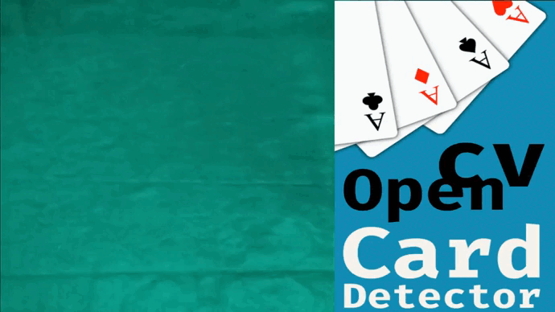

# OpenCV Card Detector


> Um projeto com OpenCV em Java para detectar e reconhecer cartas de baralho em tempo real usando uma webcam.

## 📝 Sobre o projeto

OpenCV Card Detector é um projeto que usa a biblioteca OpenCV para detectar e reconhecer cartas de baralho em tempo real
usando uma webcam. Ele permite capturar e processar quadros de uma webcam, encontrar, extrair e predizer o valor e o
naipe de uma carta, além de desenhar informações na imagem. O projeto também implementa um jogo simples de cartas usando
essas funcionalidades.

Este projeto foi criado por Igor Oliveira como um trabalho prático para o curso de Eng. da Computação. O objetivo deste
projeto é demonstrar o uso da biblioteca OpenCV para realizar operações de processamento de imagem em Java.

## 🌟 Inpiração

Este projeto foi inspirado pelo
projeto [OpenCV-Playing-Card-Detector](https://github.com/EdjeElectronics/OpenCV-Playing-Card-Detector) de Edje
Electronics. Esse projeto usa a biblioteca OpenCV em Python para detectar e reconhecer cartas de baralho em tempo real
usando uma câmera.

O meu projeto é uma releitura desse projeto para Java, usando a biblioteca opencv-java. Eu também fiz várias
modificações e melhorias no código, como alguns padrões de projeto, variáveis de ambiente para configurar alguns
parâmetros e usar anotações do lombok para reduzir a verbosidade do código.

Além disso, utilizei estratégias diferentes, como verificar porcentagem de pixels pretos nas bordas para detectar uma
imagem na vertical ou na horizontal, e na detecção de imagens usar o template matching para predizer os valores e naipes
das cartas. O template matching consiste em comparar a imagem do canto da carta com imagens de referência dos valores e
naipes das cartas, e escolher o valor e o naipe com o maior grau de similaridade. Eu também implementei um jogo simples
de cartas chamado “Can you twenty one?”, que consiste em somar 21 pontos com as cartas mostradas na webcam. Esse jogo
demonstra o uso das funcionalidades do OpenCV para criar uma aplicação interativa e divertida.

Eu agradeço ao [Edje Electronics](https://github.com/EdjeElectronics/) por compartilhar o seu projeto e me inspirar a
criar o meu. Eu recomendo que você visite o seu repositório e veja o seu trabalho.

## ⚙️ Funcionamento

Este projeto funciona da seguinte forma:

1. O projeto usa a classe ``CamService`` para capturar quadros de uma webcam usando a biblioteca ``OpenCV``. A
   classe ``CamService`` recebe um índice da webcam e uma função de callback que processa os quadros capturados.

2. A função de callback usa os métodos da classe ``OpenCVService`` para realizar operações de processamento de imagem
   nos quadros. A classe ``OpenCVService`` fornece vários métodos para tratar imagens, encontrar contornos, extrair
   informações de cartas e desenhar em imagens.

3. O primeiro passo é tratar a imagem usando o método ``treatImage``, que aplica um filtro de desfoque e uma detecção de
   bordas Canny no quadro.

4. O segundo passo é encontrar os contornos externos ordenados por área usando o
   método``returnOrderedAndExternalContours``, que usa o método ``findContours`` da biblioteca OpenCV e aplica alguns
   filtros nos contornos encontrados.

5. O terceiro passo é extrair os contornos das cartas usando o método ``getAllCardsContours``, que filtra os contornos
   baseado na sua área e forma, e verifica se eles têm quatro vértices.

6. O quarto passo é processar as cartas usando o método ``getProcessedCard``, que recebe um contorno de carta e retorna
   um objeto da classe Card com as informações da carta.

    - O método ``getProcessedCard`` realiza as seguintes operações:

        1. Calcula as dimensões do contorno da carta usando o método ``getCardDimensions``, que obtém as coordenadas do
           centro, a largura e a altura do retângulo que envolve o contorno.

        2. Corta e achata a imagem da carta usando o método ``cutAndFlatCard``, que usa a transformação de perspectiva
           para obter uma imagem plana da carta a partir do contorno.

        3. Extrai o canto da imagem da carta usando o método ``getCorner``, que obtém uma submatriz da imagem da carta
           correspondente ao canto superior esquerdo, e a redimensiona e binariza para obter as imagens do valor e do
           naipe do canto.

        4. Prediz o valor e o naipe da carta usando o método ``predictCard``, que usa o ``template matching`` para
           comparar as imagens do valor e do naipe do canto com as imagens de referência das enumerações ``Ranks``
           e ``Suits``, e escolhe o valor e o naipe com o maior grau de similaridade.

7. O quinto passo é desenhar as informações na imagem usando os métodos ``drawText``, ``drawContours`` e ``drawCards``,
   que usam os métodos ``putText`` e ``drawContours`` da biblioteca OpenCV para desenhar texto, contornos e cartas na
   imagem.

8. O sexto passo é retornar o quadro processado pela função de ``callback``, que será mostrado na janela da webcam pelo
   método ``imshow`` da biblioteca OpenCV.

## 💻 Pré-requisitos

Para instalar este projeto, você precisa ter o ``Java 17`` instalado na sua máquina. Você também precisa ter o ``Maven``
para
gerenciar as dependências do projeto. As dependências usadas neste projeto são:

* ``lombok``: Uma biblioteca que fornece anotações para reduzir a verbosidade do código Java.

* ``opencv``: Uma biblioteca que fornece várias operações de processamento de imagem.

* ``dotenv-java``: Uma biblioteca que permite carregar variáveis de ambiente de um arquivo .env.

* ``log4j-core``: Uma biblioteca que fornece funcionalidades de logging.

## 🚀 Instalando o OpenCV Card Detector

Para instalar este projeto, siga os seguintes passos:

1. Clone este repositório na sua máquina local usando o comando git clone
   ``https://github.com/reedbluue/opencv-card-detector.git``.

2. Entre na pasta do projeto usando o comando ``cd opencv-card-detector``.

3. Crie um arquivo chamado ``.env ``na raiz do projeto e defina as seguintes variáveis de ambiente:
    - ``MIN_CARD_AREA``: Área mínima de um contorno de carta
    - ``MAX_CARD_AREA``: Área máxima de um contorno de carta
    - ``MAX_BLACK_PER_CENT``: Porcentagem máxima de pixels pretos em um canto de carta

    > Você pode usar a classe ``CardAreaTest`` para consultar os valores mínimos e máximos da área das cartas que você 
    > vai usar. Essa classe captura e processa quadros da câmera e mostra a área dos contornos encontrados na imagem. 
    > Isso é útil para ajustar os parâmetros do projeto de acordo com o tipo e tamanho das cartas que você vai usar.

3. Compile o projeto usando o comando ``mvn compile``.

4. Execute o projeto usando o comando ``mvn exec:java -Dexec.mainClass="dev.ioliver.ExampleGame"``.

## ☕ Usando o OpenCV Card Detector

Para usar este projeto, você precisa ter uma webcam conectada ao seu computador. Você pode escolher o índice da webcam
que você quer usar no construtor da classe CamService. Por exemplo, se você quiser usar a primeira webcam disponível,
você pode fazer:

``` java
CamService camService=new CamService(0,frame->{
  // Aqui você pode processar o quadro capturado pela webcam
});
```

O segundo parâmetro do construtor da classe CamService é uma função de callback que recebe um quadro capturado pela
webcam e retorna um quadro processado. Você pode usar os métodos da classe OpenCVService para realizar operações de
processamento de imagem no quadro. Por exemplo, se você quiser tratar a imagem e encontrar os contornos externos
ordenados, você pode fazer:

``` java
CamService camService = new CamService(0, frame -> {
    List<MatOfPoint> contours = OPENCV_SERVICE.returnOrderedAndExternalContours(frame);
        // Aqui você pode fazer algo com os contornos encontrados
    return frame;
});
```

Se você quiser extrair os contornos das cartas do quadro, você pode usar o método getAllCardsContours. Por exemplo, se
você quiser desenhar os contornos das cartas na imagem, você pode fazer:

``` java
CamService camService = new CamService(0, frame -> {
    List<CardContour> cardsContours = OPENCV_SERVICE.getAllCardsContours(frame);
    OPENCV_SERVICE.drawContours(frame, cardsContours);
    return frame;
});
```

Se você quiser processar uma carta e extrair suas informações, como valor e naipe, você pode usar o método
getProcessedCard. Por exemplo, se você quiser desenhar o valor e o naipe de cada carta na imagem, você pode fazer:

``` java
CamService camService = new CamService(0, frame -> {
    List<CardContour> cardsContours = OPENCV_SERVICE.getAllCardsContours(frame);
    List<Card> processedCards = new ArrayList<>();
    cardsContours.forEach(contour -> {
        CardDimensions cardDimension = OPENCV_SERVICE.getCardDimensions(contour);
        Card processedCard = OPENCV_SERVICE.getProcessedCard(contour, cardDimension);
        processedCards.add(processedCard);
    });
    OPENCV_SERVICE.drawCards(frame, processedCards);
    return frame;
});
```

Você pode ver mais exemplos de utilização das classes CamService e OpenCVService nas classes CardDetectorTest,
CardAreaTest e ExampleGame.

## 📄 Documentação

Todo o projeto (ou pelo menos maior parte dele :x) foi documentado utilizando o JavaDoc. É possível ter acesso através
do link: https://reedbluue.github.io/opencv-card-detector/

## 🎥 Demonstrações

> 
> Classe ``CardDetectorTest``. Utilizei um fundo verde para melhorar a detecção dos contornos.

> 
> Classe ``CardAreaTest``. Utilize essa classe para visualizar a área ideal para seu tipo de carta.

> 
> Classe ``ExampleGame``. Implementação da detecção de cartas em um jogo simples :D

## 🤝 Reconhecimentos

* [Edje Electronics](https://github.com/EdjeElectronics/) - pela inspiração com seu projeto
* [José Marcelo PIT](https://github.com/jmarcelopit) - por todo apoio e mentoria no projeto.

## 🙋🏾‍♂️ Autor

* [Igor E. Oliveira](https://github.com/reedbluue) - Just another person

## 📝 Licença

Esse projeto está sob licença. Veja o arquivo [LICENÇA](../../../Desktop/opencv-card-detector/LICENSE) para mais
detalhes.